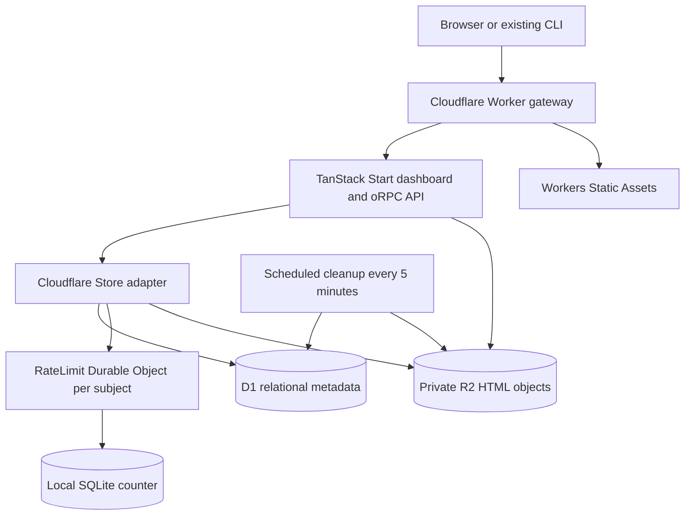

# Cloudflare gateway and hosting plan

Status: bounded runtime experiment and package separation implemented, 14 September 2026. The shared Drizzle store passes local Bun SQLite and D1 tests. The remote experiment remains stopped; full application rollout and sustained free-tier acceptance are still pending. See [runtime validation and operations](../packages/cloudflare/README.md).

## Decision

Use Workers for the selectable gateway, API and TanStack Start dashboard; D1 for relational application metadata; SQLite-backed Durable Objects scoped to individual rate-limit subjects; private R2 Standard for uploaded HTML; and Workers Static Assets for built frontend files. Keep the existing Bun/SQLite and AWS deployments.

D1 owns accounts, identities, API keys, drafts, versions, upload intents, capacity accounting and cleanup jobs. Durable Objects own only rate-limit counters. This keeps relational transactions in one database and independent IP/key coordination in independent objects. It avoids building a distributed identity/draft directory solely to support database partitioning. D1 is the managed relational choice recommended by the Cloudflare product-selection skill; Durable Objects remain part of this hosting option for a concrete coordination requirement.

“Dynamic gateway” means a provider adapter selected by deployment configuration, with provider-specific request normalization behind a common interface. It does not mean changing providers based on incoming headers or moving a live database when a setting changes.

The target is a $0 Cloudflare application/database/storage bill at small usage. That is conditional on measured CPU and usage, not a guarantee for arbitrary traffic or retention. R2 requires subscription activation and can bill for overages. Existing domain registration and external Shoo identity service costs/availability are outside this hosting estimate. No paid Workers plan is assumed.

## Architecture

Use one D1 database per environment for the initial small deployment. Identity and API-key uniqueness use SQL constraints; draft/account routing uses indexed SQL queries. Public reads go directly through the store to D1 and R2, with no rate-limit object hop. Uploads and key minting call only the relevant limiter objects. No request passes through a global application Durable Object.

D1 still has a single-threaded primary and finite throughput. This selection simplifies database operations and removes application-wide DO RPC/limiter contention; it does not promise unlimited database scalability. Benchmark representative concurrent queries and bursts. Start with primary reads and read replication disabled so revocation, disable/delete and expiry checks do not use stale replicas. Adding replication later requires an explicit consistency design. [D1 limits](https://developers.cloudflare.com/d1/platform/limits/), [D1 replication and sessions](https://developers.cloudflare.com/d1/best-practices/read-replication/).

No distributed account directory, cross-object database transaction, global limiter, KV, Queues, Containers, S3, DynamoDB or AWS gateway is required for this option.

Cloudflare documents an existing-app TanStack Start integration using its Vite plugin and Wrangler. Adapt that integration to this repository's custom server entry, rather than replacing the app with a template. [TanStack Start on Workers](https://developers.cloudflare.com/workers/framework-guides/web-apps/tanstack-start/).

## Original implementation and required seams

| Current implementation                                                                                                                | Planned change                                                                                                                                                          |
| ------------------------------------------------------------------------------------------------------------------------------------- | ----------------------------------------------------------------------------------------------------------------------------------------------------------------------- |
| `apps/server/src/lib/gateway.ts` normalizes AWS invocation context; `config.ts`, `index.ts` and `client-ip.ts` branch on `apiGateway` | Introduce a gateway interface and `direct`, `aws-api-gateway`, `cloudflare` adapters; keep selection at the runtime boundary.                                           |
| `apps/server/src/server.ts` exposes `createApplication(deps)` but also imports concrete store/storage factories                       | Extract the portable application factory from runtime composition so Cloudflare cannot import Bun SQLite or AWS clients transitively.                                   |
| `apps/server/src/db/client.ts` selects SQLite/DynamoDB from environment variables                                                     | Add explicit provider selection with compatibility for existing deployments; Cloudflare receives typed bindings.                                                        |
| `packages/store` defines a contract consumed by the application                                                                       | Use `packages/store-drizzle` for shared queries, with the D1 driver and limiter RPC in `packages/cloudflare`. Preserve public CLI/API schemas.                          |
| `packages/store-drizzle` uses `bun:sqlite` and synchronous transactions                                                               | Implement a D1 adapter using prepared SQL and atomic batches; do not reuse Bun transaction callbacks. Reuse portable models and semantics, not the Bun database client. |
| `apps/server/src/lib/s3.ts` uses the AWS SDK; app dependencies already expose `putHtml`/`getHtml`                                     | Define an object-storage interface and add native R2 binding operations. Retain the S3 adapter for other runtimes.                                                      |
| `apps/server/src/index.ts` uses Bun serving and filesystem asset discovery                                                            | Add a Worker entry exporting fetch, scheduled cleanup and the Durable Object class. Serve built files through the asset binding.                                        |
| `apps/cleanup` is coupled to DynamoDB cleanup and S3 object-version APIs                                                              | Add Cloudflare cleanup using SQL lifecycle state and R2 listing/deletion; share provider-neutral rules where useful.                                                    |

Configuration proposal: `POSTPLAN_GATEWAY`, `POSTPLAN_STORE`, and `POSTPLAN_OBJECT_STORAGE`. Supported initial profiles are `direct/sqlite/s3`, `aws-api-gateway/dynamodb/s3`, and `cloudflare/d1/r2`. Reject unsupported combinations and conflicting old/new settings. Preserve legacy `POSTPLAN_API_GATEWAY` and implicit store behavior when explicit settings are absent.

Cloudflare bindings: `POSTPLAN_DB` (D1), `RATE_LIMITS` (Durable Object namespace), `HTML_BUCKET` (R2), and `ASSETS`. Keep the public base URL, session secret, allowed login domains, upload limit and retention policy. Validate required bindings and settings before serving application traffic. Resolve configuration from the runtime environment without mutating global `process.env` per request. Keep Bun/AWS imports out of the Worker bundle through separate composition entrypoints, not only runtime conditionals.

### Worker configuration and release requirements

- Add project-local Wrangler and Cloudflare Vite dependencies compatible with the existing Vite/TanStack versions; use the Bun lockfile and inspect the installed Wrangler schema. No global CLI or silent dependency upgrades. Record resolved versions in the spike results.
- Use `wrangler.jsonc`, a compatibility date equal to the implementation date, and `nodejs_compat` for the app's Node crypto dependencies. Generate binding/runtime types using project-local `wrangler types`; regenerate after configuration changes. Match exported Durable Object classes to bindings and SQLite class-registration configuration supported by that Wrangler version.
- Select `CLOUDFLARE_ENV` before dev/build. Give each environment explicit bindings, vars, routes and resource identities where inheritance does not apply. Inspect the framework-generated configuration and deploy that environment's artifact. Never assume `--env` or `CLOUDFLARE_ENV` at deploy time changes a built target. Keep outputs separated so a subsequent build cannot silently replace the reviewed artifact.
- Verify local tests use simulated bindings, with remote bindings disabled. Verify the account, namespace and bucket before remote tests. Do not rely on omitted resource identifiers to create the intended resources automatically.
- Use ignored local secret files and deployed Workers secrets. Do not place secrets in `vars`, build output, command arguments or logs. Secret changes can deploy a new Worker version; stage them with the supported versions workflow when needed.
- Run a project-local `wrangler deploy --dry-run` against the intended generated config. Inspect packaging, entrypoint, asset directory and binding targets. This verifies packaging only; deployed acceptance remains required.

### Observability

Enable `observability.enabled` and `observability.traces.enabled` explicitly in each deployed environment. Use structured logs with a request ID, provider, operation, duration and outcome; redact cookies, credentials, identity details and uploaded HTML. Start traces at 1% sampling, and adjust log/trace sampling to fit the account allowance. Observe Worker CPU, D1 latency/rows/storage, DO calls/duration/rows, limiter writes, R2 operations, retained bytes and cleanup backlog. Use native Worker instrumentation rather than importing the Bun entry's Node OpenTelemetry bootstrap.

Cloudflare currently documents 200,000 log events/day with three-day retention on Workers Free. Traces are free during the initial beta; from 1 October 2026 the announced model counts spans against the shared observability allowance. Include this in the acceptance evidence and recheck at deployment. Exhausted telemetry allowance must not be mistaken for proof that no errors occurred. [Workers Logs](https://developers.cloudflare.com/workers/observability/logs/workers-logs/), [Workers Traces](https://developers.cloudflare.com/workers/observability/traces/).

## Gateway behavior

Each adapter returns the normalized request, trusted peer IP and request ID. Shared logic then validates allowed hosts and applies the same API/dashboard/draft routing rules.

- Direct mode retains current socket/proxy configuration. AWS mode retains invocation-context validation and its loopback readiness exception.
- Cloudflare mode takes host/protocol from the edge request URL, validates the configured application/draft hosts, and uses the edge-provided client IP only at the public Worker entry. Discard conflicting forwarded and AWS-context headers. Treat request IDs as tracing metadata, never authorization. Test IPv4/IPv6 and missing/malformed metadata; local emulation supplies explicit test metadata.
- Pass normalized metadata through the application context and derive limiter subjects at the Worker entry. Its internal methods must not infer trust from caller-supplied HTTP headers. If Worker-to-Worker ingress is later introduced, define its trust contract separately.
- Apply host validation before application routing. Draft hosts cannot serve dashboard, auth, API or health endpoints. Preserve cookie origin/CSRF checks, bearer-only public API authentication, draft CSP and `no-store` responses.
- Begin with `run_worker_first: true` so static asset routing cannot bypass host restrictions. This counts asset requests toward the Worker quota. Optimize asset-only traffic later only with tests proving host isolation; asset-first service on a separate application asset host is one possible follow-up.

For the first private experiment, use the existing `/d/<id>` path mode on `workers.dev`. For wildcard draft isolation, use an existing Cloudflare-managed domain with verified wildcard DNS, Worker routes and certificate coverage. Disable or reject alternate public hostnames after cutover. Do not assume a single Workers custom-domain configuration provides wildcard routing/TLS.

## Database and upload consistency

Implement the existing Store contract through D1 prepared statements and typed conversion of dates, booleans and JSON. Preserve oRPC/public CLI schemas, ownership, unique identity/key hashes, version ordering and deduplication. All account lookups remain SQL: unique `(provider, subject)` for sign-in, unique key hash for authentication, primary draft ID for public reads and an account index for dashboard lists. No request-supplied account identifier bypasses authorization. Include the existing shared public-upload account in concurrency and ownership tests.

Reuse the SQLite SQL migrations in `packages/store-drizzle/drizzle`; do not run `bun:sqlite` initialization or a synchronous Drizzle/Bun transaction callback against D1. Use parameterized SQL and D1 atomic batches. A batch is not an interactive JavaScript transaction: no network work or read/await/write decision may be assumed atomic. Validate the pinned API's transactional behavior and errors. [D1 Database API](https://developers.cloudflare.com/d1/worker-api/d1-database/).

`store.drafts.upload` keeps its existing in-process storage callback. No callback crosses RPC. The Cloudflare adapter executes a local prepare/write/commit protocol:

1. **Prepare:** a D1 batch validates ownership/key state, lifecycle, maintenance fence and current retention; reserves capacity and inserts a unique intent with an immutable object key, size, hash and upload deadline. SQL guards must make either every reservation write happen or none. Generate identifiers before the batch. Reserve a new draft ID conditionally, preserving tombstones.
2. **Write:** invoke the native R2 adapter and await completion. Enforce the existing HTML byte limit and outer request-body cap while reading, including chunked bodies; bounded buffering remains acceptable for the existing small HTML contract. Preserve exact UTF-8 bytes and hash. Limit the complete upload attempt to a short deadline (initially 60 seconds); never rely on the platform having a Lambda-like request timeout.
3. **Commit:** one D1 batch rechecks the intent, deadline, key state, ownership, lifecycle, maintenance fence and policy revision. Allocate a unique increasing version, insert its metadata/event, move reserved bytes to committed bytes, refresh the draft and record the result on the intent. Use expected draft revision and database constraints for conflicts. Check a durable committed-intent result before reporting success.
4. **Guard every dependent statement:** a conditional update affecting zero rows is not an SQL exception. Later batch statements must depend on the claimed intent/revision so they also do nothing, or an invariant constraint must abort the whole batch. Never assume D1 rolls back merely because a predicate did not match. Test this with competing uploads, quota reservations and cleanup claims.
5. **Retry/reconcile:** resolve uncertain responses by reading the intent before retrying. Retry only bounded revision conflicts; do not blindly replay writes. A committed intent returns its saved result, while an expired/aborted intent cannot publish. Failed R2 writes and abandoned intents retain their reservations until cleanup confirms the object is absent. This supplies internal idempotency without promising new public CLI retry semantics.

R2 and D1 do not share a transaction. Keep immutable keys unique to an intent, preserve references until deletion succeeds and reconcile late/unknown R2 outcomes. After an intent expires, fence commit immediately and retain its record through the cleanup grace period; repeated reconciliation catches a late object write. Physical deletion is eventual, not a strict deadline guarantee.

Apply D1 migrations explicitly before traffic in each environment, then run an explicit idempotent bootstrap command. Cold starts check readiness; they never recreate revoked bootstrap keys. Keep migrations additive while the preceding release remains a rollback candidate. Pin deployment-wide retention policy in a D1 settings revision so old and new Workers cannot apply different policies concurrently during a release; a deliberate policy update increments that revision.

## Durable Object boundaries

Use a `RateLimit` class extending `DurableObject`, registered with SQLite storage. Derive each deterministic `getByName()` name from a versioned encoding of `(namespace, subject, rule revision)`, with an HMAC of the subject using a dedicated stable limiter secret. Never use a raw token or IP in a name or log. The existing upload-IP, upload-key and key-mint namespaces retain their intended subjects and rules. Different subjects reach different objects; separate namespaces cannot accidentally share a counter.

A private typed RPC method accepts the trusted rule and weight, takes time from the object runtime, updates the counter in a synchronous SQLite transaction, and returns the existing success/remaining/reset shape. Preserve the current limiter's actual window behavior through parity tests. Missing trusted IP metadata must not map every client to one shared `unknown` object: reject protected operations or use the explicitly defined local-test path.

Persist before returning, initialize bounded schema work with `blockConcurrencyWhile()`, and hold no gate across external I/O. A single per-object alarm expires idle counters and calls `deleteAll()` when safe; serialize it with limiter updates and recheck the current window before removal. The alarm reschedules when newer activity exists. Duplicate alarms and restarts must not clear an active window. Do not use perpetual timers.

Multiple limiter checks are deliberately conservative: consumption of one limit is not refunded when another check fails, and a request denied by any required check never uploads. No transaction spans D1 and the limiter objects. On limiter failure, fail protected writes closed with a retryable error. Rule/secret rotation resets routing and requires an explicit release decision; preserve the secret through ordinary deploys and rollbacks.

Use Cloudflare runtime tests to prove distinct subjects are independent, identical subjects across edge instances share state, weights/window boundaries match existing behavior, and expiry/eviction/restarts do not reset active limits. [Durable Object rules](https://developers.cloudflare.com/durable-objects/best-practices/rules-of-durable-objects/), [testing guidance](https://developers.cloudflare.com/durable-objects/examples/testing-with-durable-objects/).

## R2 and retention

Use R2 Standard with native bindings, a private bucket and immutable application version keys. Workers Static Assets is for build output; runtime uploads belong in R2. Never expose `r2.dev` or a public bucket domain that bypasses disable/delete/expiry checks. Do not assume S3 bucket-version enumeration is available or needed: application versions remain separate object keys. [R2 access options](https://developers.cloudflare.com/r2/get-started/).

Carry forward the existing serverless retention policy: default 90 days after last successful upload, `0` disables age expiry, and a successful upload refreshes the whole plan including previous versions. Titles/views do not refresh retention. Implement read-time expiry on every access, then daily discovery and bounded cleanup resumed every five minutes with persisted continuation state.

Use `ACTIVE -> DELETING -> tombstone`, conditional claims and the existing 24-hour upload grace period. Delete R2 objects before removing the metadata needed to find them. Retry partial failures; never revive claimed plans. Reconcile abandoned intents and old orphan objects. Avoid a blanket R2 age lifecycle rule: it could delete an old version still retained by a recently updated plan. Port the detailed invariants from `docs/aws-serverless-terraform-plan.md` without its AWS API assumptions.

Use one Cron Trigger every five minutes. Store indexed D1 jobs with `nextAttemptAt`, cursor, attempt count and a lease/fencing token. A scheduled invocation claims a bounded due page, awaits its work, and commits progress only with the current token. Resume pending jobs on the next tick; start a new full discovery pass at most daily. Back off failed jobs with a bounded delay and retain their records until success. Keep each tick within measured CPU, query, subrequest and wall-time budgets; missed ticks resume from durable state. Monitor oldest due job and measured purge delay.

Claims permanently fence upload commit for deleting drafts. Before deleting any orphan, atomically claim its expired intent and verify that no committed version references its immutable key. Delete R2 first; only then remove child metadata and release accounted bytes. Retry partial deletion and lost responses safely. A maintenance fence pauses new claims; export waits for existing leases/I/O to settle. No fire-and-forget promise or `waitUntil()` is the durable retry mechanism.

Set an initial 8 GB bucket budget: 6 GB for application objects including pending/orphan bytes, plus 2 GB reserved for retained backup objects and metadata exports. Maintain the 6 GB reservation ledger in the same D1 transaction as upload intents. Only writes/reservations/purges touch it; public reads and limiter checks do not. Reject new uploads if a transaction would exceed capacity. Release bytes only after verified physical removal, not logical deletion or intent expiry. Reconcile the ledger against paginated R2 inventory daily; unexplained excess freezes new reservations until repaired. Inventory pagination is not a snapshot, so compare against intent/reference state before acting.

Refreshed plans retain old versions indefinitely; retention alone cannot enforce the budget. Protect objects referenced by the retained backup manifests even after logical deletion, and include them in accounting until purged. Keep seven daily metadata snapshots initially; stop new exports and alert if the 2 GB reserve cannot hold a safe replacement. Do not delete the last verified backup to make space automatically. R2 operation counters and sampling provide headroom, not a provider-enforced account-wide spending cap.

## Free-tier envelope

Cloudflare documentation checked on 14 September 2026. These are shared account allowances, so other workloads reduce availability.

| Resource                | Published free allowance                                                            | Experiment target                                                                                                                                                                      |
| ----------------------- | ----------------------------------------------------------------------------------- | -------------------------------------------------------------------------------------------------------------------------------------------------------------------------------------- |
| Worker invocations      | 100,000/day; 10 ms CPU per invocation                                               | Below 10,000/day including worker-first assets and scheduler; representative p99 CPU below 8 ms and no resource-limit errors.                                                          |
| D1                      | 5 million rows read/day; 100,000 rows written/day; 5 GB account total               | Below 2.5 million reads and 50,000 writes/day, including indexes, authentication updates, cleanup and migrations.                                                                      |
| D1 database limits      | 500 MB/database on Free; 10 databases/account; 50 queries/Worker invocation         | Alert at 300 MB, pause nonessential growth at 350 MB; keep every route/tick below 40 SQL statements and verify total subrequest limits too. Reserve separate preview/restore capacity. |
| Durable Object requests | 100,000/day                                                                         | Below 25,000/day for required limiter checks and expiry alarms; no store-call amplification on public reads.                                                                           |
| Durable Object duration | 13,000 GB-s/day                                                                     | Measure aggregate usage across active limiter objects; no idle connections or perpetual timers.                                                                                        |
| Durable Object SQLite   | 5 million rows read/day; 100,000 rows written/day; 5 GB total                       | Below half the daily row quotas and 100 MB total; promptly remove expired per-subject state.                                                                                           |
| R2 Standard             | 10 GB-month; 1 million Class A and 10 million Class B operations/month; free egress | 8 GB capacity budget; target below half each operation allowance after cleanup, inventory and backups.                                                                                 |
| Static Assets           | Free/unlimited asset-only requests and no extra asset storage charge                | Worker-first requests still consume Worker quota.                                                                                                                                      |
| Logs/traces             | See observability section                                                           | Sample and budget events, including the announced October trace-accounting change.                                                                                                     |

Sources: [Worker limits](https://developers.cloudflare.com/workers/platform/limits/), [D1 pricing](https://developers.cloudflare.com/d1/platform/pricing/), [D1 limits](https://developers.cloudflare.com/d1/platform/limits/), [Durable Object pricing](https://developers.cloudflare.com/durable-objects/platform/pricing/), [R2 pricing](https://developers.cloudflare.com/r2/pricing/), [Static Assets billing](https://developers.cloudflare.com/workers/static-assets/billing-and-limitations/).

Illustrative storage: 100 new versions/day at 200 KiB each for 90 days is about 1.84 GB before backups and orphans. This only reaches a steady state if those versions actually become eligible for removal; refreshing the same plans indefinitely invalidates that assumption. Count each SQL statement, index write, limiter RPC and alarm when estimating amplification. The metadata-growth gate must use measured row/index sizes, not HTML volume.

Workers/D1/DO free quota exhaustion causes failed requests/operations. R2 has metered overages rather than a guaranteed zero-spend stop. Inspect current account usage and subscription status before deployment. The 10 ms Worker CPU limit is the first feasibility gate: benchmark SSR, authentication, HTML processing and maximum-size uploads, not only `/healthz`. If it fails, optimize and retest; explicitly revise the architecture or cost target rather than silently requiring Workers Paid.

## Implementation sequence and acceptance

1. **Portable runtime and gateway:** extract composition, add adapters and legacy-setting validation. Existing direct/AWS tests pass; spoofed headers and unknown hosts are rejected. Keep changes limited to these boundaries.
2. **Early Cloudflare build spike:** add Wrangler and the Cloudflare Vite integration with typed bindings, isolated development/preview configuration and a pinned compatibility date. Run under workerd. Prove SSR, session crypto, Shoo token verification, oRPC errors/serialization and upload parsing are compatible. Verify the bundle has no Bun SQLite, filesystem-serving or AWS credential-provider dependencies. Record bundle/startup measurements.
3. **D1 store and scoped limiters:** implement the selected topology, explicit D1 migrations, contract parity, conditional batch guards, reservations and upload intents. Add a separate Cloudflare Vitest suite with compatible installed versions; preserve Bun tests. Apply real migrations in tests. Cover simultaneous first login, key creation/revocation, shared public-account uploads, version conflicts, zero-row guards, quota races, expired intents, limiter window/weight parity, alarms and restart persistence. Prove unrelated subjects do not share an object. Validate the SQL query plans and per-request statement counts.
4. **R2 and lifecycle:** implement storage, cleanup and budget reservations. Exercise upload/delete races, failed writes, lost commit responses, partial deletion, retention changes and orphan recovery. Verify byte-exact HTML, versions, CSP, disabled/deleted/expired access and HEAD behavior.
5. **Full local acceptance:** run repository `bun run check`, `bun run build`, and `bun run pack:cli` plus the Cloudflare build and workerd integration suite. Exercise actual CLI login/upload/update/list/download against the preview runtime and dashboard sign-in/forms. Verify assets and application endpoints on both application and draft hosts.
6. **Deployed free-tier experiment:** deploy a separate preview Worker/D1 database/limiter namespace/R2 bucket using an existing account after implementation. Configure secrets and permitted Shoo callback origin. Run the same flows remotely, restart/redeploy, benchmark cold/warm SSR and maximum-size uploads, and observe daily usage including cleanup. Local emulation does not prove provider CPU/free-tier acceptance.
7. **Promotion decision:** deliver measured CPU, latency, request/row amplification, storage growth, backup restore evidence and remaining account headroom. Mark the option ready only when all application flows and the cost envelope pass. Until then the existing deployment remains the default.

Runtime layout: `packages/cloudflare` owns the Worker, D1 driver, R2 adapter, Durable Object, Vite plugin, Wrangler configuration, tests and usage guard. `packages/lambda` owns AWS adapters and default build options. `apps/server/vite.config.ts` selects runtime options using `POSTPLAN_RUNTIME` (`aws` by default, or `cloudflare`) while sharing TanStack/React configuration. `POSTPLAN_DATABASE` selects exactly one backend: AWS supports `sqlite` or `dynamodb`; Cloudflare supports only `sqlite` (D1). `packages/store-drizzle` contains portable SQLite queries and an atomic batch interface, with Bun access isolated behind `/client`. Wrangler owns experimental Cloudflare resources; existing AWS Terraform state remains independent.

## Recovery and scope

Start the experiment empty. Existing SQLite/DynamoDB/S3 data migration is a separate cutover step, not an automatic effect of gateway selection. If needed, freeze writes, export identities/key hashes/plans/versions, copy referenced objects, verify hashes and counts, import with original IDs, and test session/account continuity before changing the public URL.

Use D1 Time Travel for recent database recovery (seven days on Free), plus seven daily portable metadata exports for a tested restore into a separate D1 database. A D1 restore does not restore R2 bytes or limiter state. Keep a manifest of referenced immutable objects and hashes, and protect those objects for the backup window. [D1 recovery](https://developers.cloudflare.com/d1/reference/time-travel/).

For the first portable export, acquire a durable D1 maintenance fence. All metadata mutations and prepare/commit batches check it; pause scheduler claims and wait for existing cleanup leases and upload attempts to settle. Export bounded pages with schema version, snapshot time, manifest and checksums. Resume only after the manifest is durable. A failed export has an explicit operator recovery path for the fence. Public reads continue; limiter state is deliberately outside the metadata snapshot. Measure the write pause and backup size.

Restore-test in a separate environment: import metadata, verify integrity and counts, copy referenced HTML into its own R2 bucket and verify hashes, then exercise authentication, upload/version history and disable/delete. Capacity for the temporary restore copy must be reserved in the account's free allowance; stop before exceeding it. Preserve the limiter namespace and secret on code rollback so limits remain effective; resetting counters during disaster recovery is an explicit decision.

Keep the previous Worker artifact and stable D1/R2/limiter bindings. Code rollback requires compatible schema and policy settings; it never rolls back connected data. Returning to an older provider after Cloudflare accepts writes requires reverse data migration or an explicit recovery decision.

## Review resolution

| Review finding            | Incorporated decision                                                                                                                        |
| ------------------------- | -------------------------------------------------------------------------------------------------------------------------------------------- |
| Global Durable Object     | D1 owns relational metadata; per-subject Durable Objects own only rate limits. Routing is SQL, with no distributed identity/draft directory. |
| Deployment isolation      | Build-time environment selection, explicit bindings, generated type/config inspection and dry-run packaging.                                 |
| Missing observability     | Native logs/traces, sampling and per-product usage targets, including trace-accounting changes.                                              |
| Cleanup and snapshot gaps | Five-minute resumable scheduler, D1 leases/fencing, immutable keys, byte reservations and fenced manifest-based exports.                     |

The [compatibility experiment](../packages/cloudflare/README.md) now implements the portable application entry, Cloudflare request normalization and bounded D1/R2/Durable Object probes. Local and remote HTTP tests passed on 14 September 2026; public access was disabled afterward. This is evidence for the initial runtime spike, not completion of the Store adapter or the free-tier promotion gate.

For the personal test account, do not enable WAF or upgrade Workers. Keep the R2 bucket private and limit the protected experiment to 20 lifetime probes of at most 512 KiB, using a persistent atomic D1 counter. Verify remaining account allowances before remote work and bucket emptiness afterward. Disable public and preview URLs when testing ends. R2 remains usage billed beyond its free allowance; this experiment's bound does not constrain other applications in the account.
